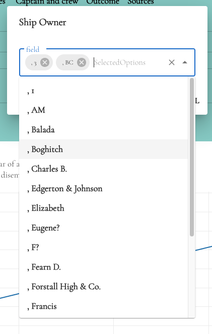

# Autocomplete Box Component

This component represents an autocomplete box that allows users to select multiple options.

## Installation
No additional installation is required for this component.

## Usage
Import the necessary modules:

```jsx
import {
  FunctionComponent,
  useEffect,
  useState,
  useMemo,
  SyntheticEvent,
} from "react";
import { AppDispatch, RootState } from "@/redux/store";
import { useDispatch, useSelector } from "react-redux";
import { fetchAutoComplete } from "@/fetchAPI/fetchAutoCompleted";
import { Autocomplete, Stack, TextField, Box, Typography } from "@mui/material";
import "@/style/table.scss";
import "react-dropdown-tree-select/dist/styles.css";
import {
  AutoCompleteInitialState,
  AutoCompleteOption,
  AutocompleteBoxProps,
  RangeSliderState,
} from "@/share/InterfaceTypes";
import {
  setAutoCompleteValue,
  setAutoLabel,
  setIsChangeAuto,
} from "@/redux/getAutoCompleteSlice";
```

`AutocompleteBox`
This component represents an autocomplete box that allows users to select multiple options.
```jsx
const AutocompleteBox: FunctionComponent<AutocompleteBoxProps> = (props) => {
  // Component logic goes here
    const { varName, rangeSliderMinMax: rangeValue } = useSelector(
    (state: RootState) => state.rangeSlider as RangeSliderState
  );
  const { autoCompleteValue } = useSelector(
    (state: RootState) => state.autoCompleteList as AutoCompleteInitialState
  );
  const [autoList, setAutoLists] = useState<AutoCompleteOption[]>([]);
  const [selectedValue, setSelectedValue] = useState<AutoCompleteOption[]>([]);
  const [autoValue, setAutoValue] = useState<string>("");

  const handleInputChange = useMemo(
    () => (event: React.SyntheticEvent<Element, Event>, value: string) => {
      event.preventDefault();
      setAutoValue(value);
    },
    []
  );
  
  return (
    <Stack spacing={3} sx={{ width: 350 }}>
      <Autocomplete
        multiple
        id="tags-outlined"
        options={autoList}
        getOptionLabel={(option) => option.label}
      />
    </Stack>
  )
}
```
## Component Structure
The component structure includes MUI components such as `Stack`, `Autocomplete`, and `TextField` to handle the autocomplete functionality and display the selected options.

## Component Logic
The component logic includes handling the input change event, fetching autocomplete options based on the input value, handling the autocomplete change event to update the selected options, and dispatching actions to update the autocomplete state.

## Example Usage
```jsx
import AutocompleteBox from "./AutocompleteBox";

function MenuListDropdown() {
  return (
    <div>
      {/* Other components */}
      <AutocompleteBox
        varName="example"
        rangeSliderMinMax={rangeValue}
        autoCompleteValue={autoCompleteValue}
      />
      {/* Other components */}
    </div>
  );
}

export default App;
```
<br/>



That's it! You can now use the AutocompleteBox component to provide an autocomplete box with multiple selection options in your application.