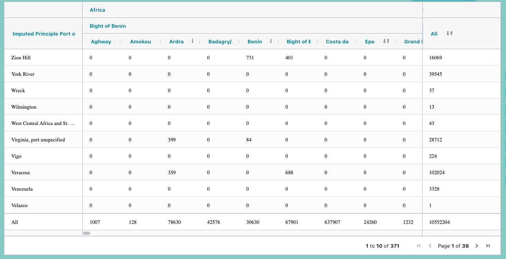

# PivotTables Component 
The `PivotTables` component is a React component designed for displaying and interacting with pivot tables using the `ag-Grid` library. This component is part of a larger application and serves the purpose of rendering pivot tables with various customization options.

## Prerequisites
Before using the `PivotTables` component, ensure that you have the following dependencies and prerequisites installed:

- `React:` The component is designed for use within a React application.
- `ag-Grid:` This component relies on ag-Grid for rendering and managing the pivot tables.
- `Material-UI:` Material-UI is used for rendering certain UI components like dropdowns.
- `Redux:` The component interacts with Redux for state management.
- `Various` utility functions and assets: The component relies on utility functions, constants, and assets that are imported from various locations in your project.

## Installation
To use the `PivotTables` component, you can import it directly into your React application. Ensure that you have the necessary dependencies installed in your project.

```jsx
import PivotTables from './PivotTables'; // Adjust the import path as needed
```

## Usage
Once imported, you can use the PivotTables component within your React application. Here's an example of how to use it:

```jsx
import React from 'react';
import PivotTables from './PivotTables'; // Adjust the import path as needed

function App() {
  return (
    <div className="App">
      <PivotTables />
    </div>
  );
}

export default App;

```
## Component Features

## Props
The `PivotTables` component does not accept any props directly. Instead, it relies on Redux for state management and configuration. The component connects to the Redux store to retrieve data and configuration options.

## Redux State
The component relies on the following pieces of Redux state:

- `getPivotTablesData:` This state contains information about the column definitions and row data for the pivot tables.
- `autoCompleteList:` Provides data for auto-complete functionality.
- `rangeSlider:` Contains data related to range slider options.
- `getScrollPage:` Manages the current page.
- `getDataSetCollection:` Contains information about the selected data set collection.
- `getGeoTreeData:` Provides information about geographical tree data.
- `getCommonGlobalSearch: `Manages the global search functionality.

## Functionality
The `PivotTables` component provides the following functionality:

- Rendering pivot tables using ag-Grid.
- Customization of pivot table columns, rows, and cell values.
- Aggregation options (sum, average) for cell values.
- Exporting pivot table data as a CSV file.
- Responsive layout handling.
- Loading indicator while data is being fetched.

## Styling
The component uses CSS for styling, and you should ensure that the required CSS files are imported into your project. It also utilizes Material-UI components for certain UI elements.

## Customization
You can customize the behavior and appearance of the `PivotTables` component by modifying the Redux state, utility functions, and constants used within the component. Additionally, you can style the component by modifying the CSS classes and styles used in the component's JSX.


## Dependencies
Ensure that you have the following dependencies installed and configured in your project:

- `React:` Used as the base framework for building the component.
- `ag-Grid:` A powerful grid library used for rendering and managing pivot tables.
- `Material-UI:` Used for rendering select dropdowns and other UI components.
- `Redux:` Utilized for state management.
- `Various` utility functions and assets imported from specific paths in your project.


## License
This component is subject to the license terms and conditions specified in your project. Make sure to comply with the licensing requirements of the libraries and assets used within this component.

## Support and Contributions
For support or contributions, please refer to the documentation and guidelines of your project's development team or maintainers. This component may be part of a larger application, and its development process should align with your project's development practices.

## Disclaimer
This README provides an overview of the `PivotTables` component's usage and features as of the knowledge cutoff date in September 2021. It is recommended to refer to any updated documentation or changes made to the component after this date for the most accurate and up-to-date information.


