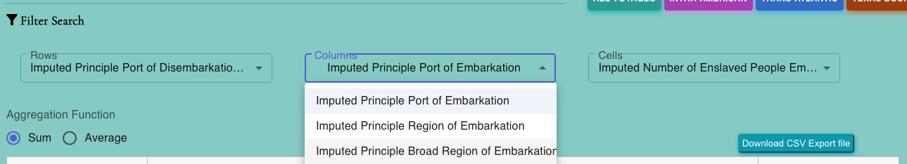

# SelectDropdownPivotable Component
The `SelectDropdownPivotable` component is a React-based component that provides a user interface for selecting options related to pivot tables. It includes dropdown menus for selecting rows, columns, and cells for pivot table configurations. This component is typically used in conjunction with pivot table functionality.

## Usage
To use the SelectDropdownPivotable component in your project, follow these steps:

1) Import the component:
```jsx
import { SelectDropdownPivotable } from './SelectDropdownPivotable';
```
2) Include the `SelectDropdownPivotable` component within your application, typically within a parent component or view where pivot table configuration is required.

```jsx
<SelectDropdownPivotable
  selectRowValue={/* An array of available pivot row options */}
  selectColumnValue={/* An array of available pivot column options */}
  selectCellValue={/* An array of available pivot cell options */}
  selectedPivottablesOptions={/* The currently selected pivot table options */}
  handleChangeOptions={/* A callback function to handle option changes */}
/>
```
## Props
The `SelectDropdownPivotable` component accepts the following props:

- `selectRowValue` (type: `PivotRowVar[]`): An array of available pivot row options.
- `selectColumnValue` (type: `PivotColumnVar[]`): An array of available pivot column options.
- `selectCellValue` (type: `PivotCellVar[]`): An array of available pivot cell options.
- `selectedPivottablesOptions` (type: `PivotTablesProps`): The currently selected pivot table options.
- `handleChangeOptions` (type: `(event: SelectChangeEvent<string>, name: string) => void`): A callback function to handle changes in selected options.

## Functionality
- `Dropdown Menus:` The component provides three dropdown menus labeled "Rows," "Columns," and "Cells." Users can select options from these menus for pivot table configuration.

- `Menu Styling:` The dropdown menus have a fixed height and maximum width to ensure a consistent and user-friendly appearance.

- `Options Mapping: `Options are mapped from the provided arrays (`selectRowValue`, `selectColumnValue`, `selectCellValue`) and displayed as menu items.

- `Option Selection:` When users select an option from a menu, the handleChangeOptions callback function is called, passing the selected option and the corresponding option type ('`row_vars`', '`column_vars`', '`cell_vars`') as arguments.


## Styling
- The component includes styles defined in an external SCSS file `('@/style/table.scss').`


## Development and Maintenance
- The component is a functional component and does not maintain its own state. Instead, it relies on props and callbacks to interact with parent components or containers.

- Developers can customize the appearance and behavior of the component as needed based on project requirements.

- Ensure that the provided props (`selectRowValue`, `selectColumnValue`, `selectCellValue`, `selectedPivottablesOptions`, handleChangeOptions) are correctly initialized and updated in the parent component.

- Developers should also ensure that the styles defined in `'@/style/table.scss'` match the overall styling of the project.




<br/>
That's it! You can now use the `SelectDropdownPivotable` component to provide min and max values in your application.

Please note that this documentation provides an overview of the `SelectDropdownPivotable` component and its functionality. Developers integrating this component into their project should refer to the actual code for implementation details and may need to make adjustments based on specific project requirements and updates beyond the knowledge cutoff date.