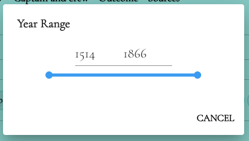

# Range Slider Component

This is a React component that provides a range slider functionality. It allows users to select a range of values within a specified minimum and maximum range. The component also includes input fields for directly entering the start and end values of the range.

## Installation
To use the Range Slider component in your React project, you need to follow these steps:

1) Install the required dependencies by running the following command:
```js
npm install @mui/material react-redux
```
2) Create a file called RangeSlider.tsx and paste the code of the Range Slider component into it.

3) Import the component in your desired location and use it in your React application.
```jsx
import RangeSlider from './RangeSlider';
```

## Usage
The Range Slider component can be used by providing the necessary props and integrating it into your application's logic. Here's an example of how to use the component:

```jsx
import { useDispatch, useSelector } from 'react-redux';
import { setRangeValue, setKeyValue, setIsChange, setRangeSliderValue } from '@/redux/rangeSliderSlice';

// Inside your component
const dispatch = useDispatch();
const { rangeValue, varName, rangeSliderMinMax } = useSelector(state => state.rangeSlider);

// Handler for slider change event
const handleSliderChange = (event, newValue) => {
  // Handle slider change event
};

// Handler for slider change mouse up event
const handleSliderChangeMouseUp = () => {
  // Handle slider change mouse up event
};

// Handler for input change event
const handleInputChange = event => {
  // Handle input change event
};

// Render the RangeSlider component
return (
  <RangeSlider
    rangeValue={rangeValue}
    varName={varName}
    rangeSliderMinMax={rangeSliderMinMax}
    handleSliderChange={handleSliderChange}
    handleSliderChangeMouseUp={handleSliderChangeMouseUp}
    handleInputChange={handleInputChange}
  />
);
```
Make sure to provide the necessary Redux state and action dispatching logic for the component to work correctly.

## Props

The Range Slider component accepts the following props:

- `rangeValue` (object): The range values selected by the user.
- `varName` (string): The name of the variable associated with the range slider.
- `rangeSliderMinMax` (object): The minimum and maximum values for the range slider.
- `handleSliderChange` (function): A callback function to handle the slider change event.
- `handleSliderChangeMouseUp` (function): A callback function to handle the slider change mouse up event.
- `handleInputChange` (function): A callback function to handle the input change event.

<br/>



<br/>
That's it! You can now use the `RangeSlider` component to provide min and max values in your application.

## Contributing
Contributions to the Range Slider component are welcome. If you encounter any issues or have suggestions for improvements, please create a new issue or submit a pull request on the GitHub repository.
