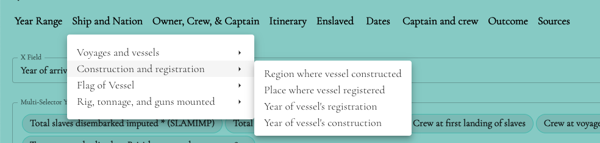

# CanscandingMenu
This is a React component called CanscandingMenu that represents a menu with dropdown functionality. It is built using the Material-UI library.

## Installation
To use this component in your React application, you need to install the required dependencies. Make sure you have React and Material-UI installed in your project. You can install them using npm or yarn.

```js
npm install react @mui/icons-material @mui/material
```

## Usage
You can import the CanscandingMenu component and use it in your React application as follows:

## Props
The `CanscandingMenu` component accepts the following props:

- `props` (CanscandingMenuProps): An object containing additional props for customization. This prop is optional.
## Example
Here's an example of how you can use the CanscandingMenu component in your application:

```jsx 
import { CanscandingMenu } from './CanscandingMenu';

function App() {
  return (
    <div>
      {/* Your other components */}
      <CanscandingMenu />
      {/* Your other components */}
    </div>
  );
}

export default App;
```


Please note that you may need to adjust the import statements and file paths based on your project's file structure.

That's it! You can now use the `CanscandingMenu` component in your React application to display a menu with dropdown functionality.