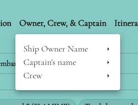

# Dropdown
This is a React component called Dropdown that provides dropdown functionality. It is built using the Material-UI library.

## Installation
To use this component in your React application, you need to install the required dependencies. Make sure you have React and Material-UI installed in your project. You can install them using npm or yarn.

```js
npm install react @mui/material
```
```js
yarn add react @mui/material
```

## Usage
You can import the Dropdown component and use it in your React application as follows:

```jsx
import { Dropdown } from './Dropdown';

function App() {
  return (
    <div>
      {/* Your other components */}
      <Dropdown trigger={<button>Open Dropdown</button>} menu={[<div>Menu Item 1</div>, <div>Menu Item 2</div>]} />
      {/* Your other components */}
    </div>
  );
}

export default App;
```
## Props
The `Dropdown` component accepts the following props:

- `trigger` (ReactElement): The element that triggers the dropdown menu to open. This is a required prop.
- `menu` (ReactElement[]): An array of elements representing the menu items in the dropdown. Each element can have its own sub-menu by providing a nested `menu` prop. This prop is optional.
- `keepOpen` (boolean): A flag indicating whether the dropdown should remain open when clicking outside of it. This prop is optional.
- `isOpen` (boolean): A controlled prop that allows you to manually control the open state of the dropdown. When `isOpen` is `true`, the dropdown is open, and when it is false, the dropdown is closed. This prop is optional.
- `onOpen` ((event: MouseEvent<Element, MouseEvent> | null) => void): A callback function that is called when the dropdown is opened or closed. This prop is optional.

## Example
Here's an example of how you can use the Dropdown component in your application:

import { Dropdown } from './Dropdown';
```jsx
function MenuListDropdown() {
  return (
    <div>
    <Dropdown
        key={`${item.label}-${index}`}
        trigger={
            <Button
                sx={{
                  color: "#000",
                  fontWeight: 600,
                  textTransform: "none",
                  fontSize: 18,
                }}
              >
                {item.label}
              </Button>
            }
        menu={renderDropdownMenu(item.children)}
          />
    </div>
  );
}

export default MenuListDropdown;
```

Please note that you may need to adjust the import statements and file paths based on your project's file structure.

That's it! You can now use the Dropdown component in your React application to add dropdown functionality to your user interface.