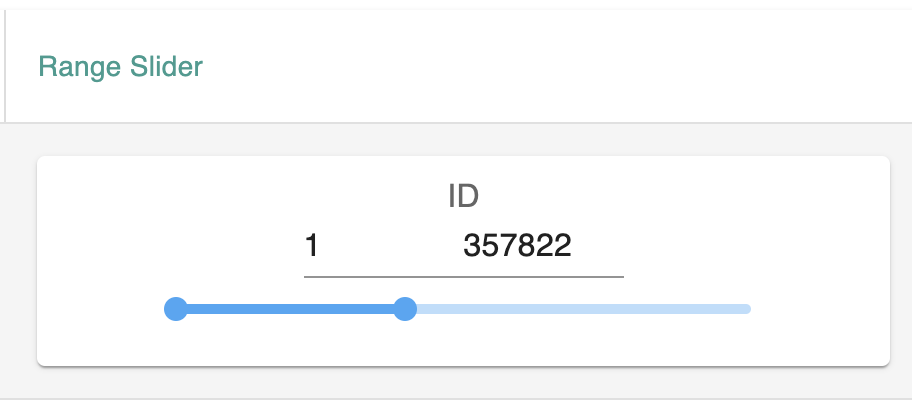

# Slider
The Slider component provides a user-friendly interface for selecting a value within a specified range. It allows users to adjust a numerical value by dragging a slider handle along a track. This component is commonly used for filtering and parameter selection.
## Range Slider

The Range Slider is used for selecting value ranges for numberic values. The component uses MUI components `Slider` and `Input` and support features including: 

- setting the default range as minimum and maximum values of the variable selected
- drag the slider to change the range
- click on the slider bar to change the range
- enter values in the input boxes to change the range
- adjust the value to minimum or maximum when the value entered in the input box is out of range

An example Range Slider component looks like following: 

### External Component Used 
- [MUI Slider](https://mui.com/material-ui/api/slider/): slider component from Material-UI library
- [MUI Input](https://mui.com/material-ui/api/input/): input box component from Material-UI library

### Functions
|  Name     |   Functionality  |
| -------   |  --------------- |
|  GetSlider                |   Render range slider component based on the varibale selected       |
|  handleCommittedChange    |   Set the value when user drags the slider, update filter object |
|  handleChange             |   Set the value when user clicks on the slider bar  |
|  handleBlur               |   Handle the situation when the input value is out of range, update filter object |

&nbsp;

