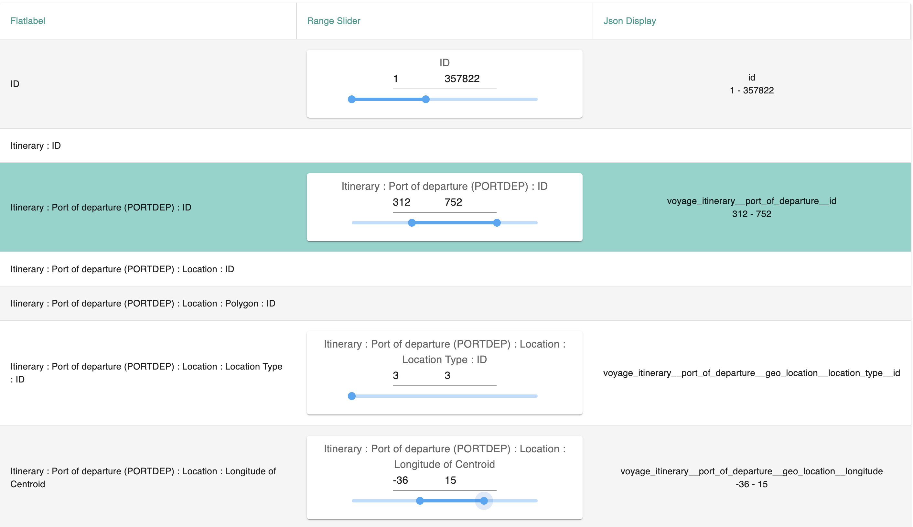

# TableRange Slider

&nbsp;

## Overview
The TableRangeSlider component is designed to display a table with three columns. It provides a user interface to select a range of values using sliders and displays the selected range in real-time. Let's explore each column's functionality:

&nbsp;

**Column 1: Options Display**<br>
```Column 1``` displays a list of options with their corresponding type, flat label, and label. Each option represents a range that can be selected using the TableRangeSlider.


**Column 2: Range Slider**<br>

When a label in ```Column 1``` is clicked, ```Column 2``` displays a range slider. 
The range slider allows the user to select a minimum and maximum value within the specified range. The label name of the selected option is also displayed for reference.

**Column 3: Selected Range Display**<br>
```Column 3``` displays the selected range of minimum and maximum values from the range slider in ```Column 2```. As the user adjusts the range by sliding the slider, the selected minimum and maximum values are updated and displayed in real-time.<br>


### Component Interaction
The ```TableRangeSlider``` component provides an interactive user experience for selecting ranges. 
Here's how it works:
<br>
- The user clicks on a label in Column 1 to select an option.
- Column 2 updates and displays a range slider corresponding to the selected option.
- The user slides the range slider to choose a desired minimum and maximum value.
- Column 3 updates and displays the selected minimum and maximum values in real-time.

By following this process, the user can dynamically select ranges and observe the selected values in the table.
An example Range Slider component looks like following: 




### External Component Used 
- [MUI Slider](https://mui.com/material-ui/api/slider/): slider component from Material-UI library
- [MUI Input](https://mui.com/material-ui/api/input/): input box component from Material-UI library


### Functions
|  Name     |   Functionality  |
| -------   |  --------------- |
|  GetSlider                |   Render range slider component based on the varibale selected       |
|  handleCommittedChange    |   Set the value when user drags the slider, update filter object |
|  handleChange             |   Set the value when user clicks on the slider bar  |
|  handleBlur               |   Handle the situation when the input value is out of range, update filter object |

&nbsp;


## Directory
```
src
|
|___CommonComponent
|   |
|   |___TableRangeSlider.tsx
|   |___Slider.tsx

```


