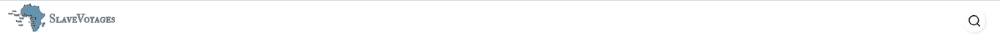

# Header Logo and Search Component
This component represents the header logo and search bar of the application.

## Installation
No additional installation is required for this component.

## Usage
Import the necessary modules:

```jsx
import { AppBar, Box, CssBaseline, Typography, Toolbar } from "@mui/material";
import { WHITE } from "@/styleMUI";
import LOGOVoyages from "@/assets/sv-logo_v2.svg";
import SearchVoyages from "@/assets/searchICON.svg";
```

```HeaderLogoSearch```
This component represents the header logo and search bar.

```jsx
export default function HeaderLogoSearch() {
  // Component logic goes here
  return (
      <Box>
       <AppBar> </AppBar>
     </Box>
  )
}
```

## Component Structure
The component structure includes an `AppBar` component from MUI, which contains the logo and search bar. It also uses other MUI components such as `Box`,`Typography` and `Toolbar` for styling and layout.

## Component Logic
The component logic includes rendering the logo and search bar using JSX.

## Example Usage

```jsx
import HeaderLogoSearch from "./HeaderLogoSearch";

function App() {
  return (
    <div>
      {/* Other components */}
      <HeaderLogoSearch />
      {/* Other components */}
    </div>
  );
}

export default App;
```


That's it! You can now use the HeaderLogoSearch component to display the header logo and search bar in your application.


