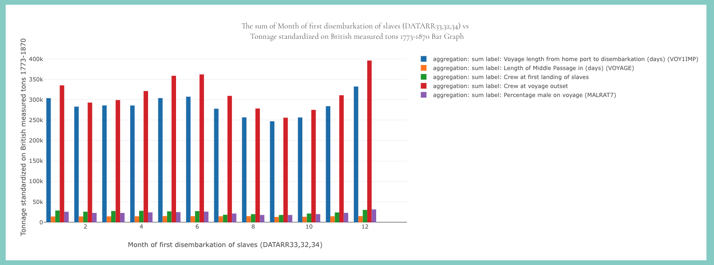

# Bar Graph Component

This component is responsible for displaying a bar graph using the Plotly.js library. It fetches data from an API and allows the user to customize the graph by selecting different options and variables.

## Installation
Make sure you have the following dependencies installed:

- React
- Plotly.js
- MUI (Material-UI)
- Redux
You can install them using npm:
```js
npm install react plotly.js @mui/material react-redux
```
## Usage
Import the necessary modules:

```jsx
import { useState, useEffect, ChangeEvent, useCallback } from "react";
import Plot from "react-plotly.js";
import { Data } from "plotly.js";
import VOYAGE_BARGRAPH_OPTIONS from "@/utils/VOYAGE_BARGRAPH_OPTIONS.json";
import { Grid, SelectChangeEvent } from "@mui/material";
import { useWindowSize } from "@react-hook/window-size";
import { AppDispatch, RootState } from "@/redux/store";
import { useDispatch, useSelector } from "react-redux";
import { useGetOptionsQuery } from "@/fetchAPI/fetchApiService";
import { SelectDropdown } from "./SelectDropdown";
import { AggregationSumAverage } from "./AggregationSumAverage";
import { fetchVoyageGraphGroupby } from "@/fetchAPI/fetchVoyageGroupby";
import {
  PlotXYVar,
  VoyagesOptionProps,
  Options,
  RangeSliderState,
  AutoCompleteInitialState,
  currentPageInitialState,
  BargraphXYVar,
} from "@/share/InterfaceTypes";
import { fetchOptionsFlat } from "@/fetchAPI/fetchOptionsFlat";
```

`BarGraph`

This component represents a bar graph that displays data in a bar chart format.

```jsx
function BarGraph() {

  const [optionFlat, setOptionsFlat] = useState<Options>({});
  const [width, height] = useWindowSize();
  const [showAlert, setAlert] = useState(false);
  const [barGraphSelectedX, setSelectedX] = useState<PlotXYVar[]>([]);
  const [barGraphSelectedY, setSelectedY] = useState<PlotXYVar[]>([]);
  const [barData, setBarData] = useState<Data[]>([]);


    const handleChangeAggregation = useCallback(
    (event: ChangeEvent<HTMLInputElement>) => {
      setAggregation(event.target.value);
    },
    []
  );

  const handleChangeBarGraphOption = useCallback(
    (event: SelectChangeEvent<string>, name: string) => {
      const value = event.target.value;
      setBarOptions((prevVoyageOption) => ({
        ...prevVoyageOption,
        [name]: value,
      }));
    },
    []

    return (
    <div>
      <Grid>
        <Plot
          data={barData}
          layout={{
            width: maxWidth,
            height: height * 0.45,
            title: 'barGraph'

            xaxis: {
              title: {'X Graph'},
              fixedrange: true,
            },
            yaxis: {
              title: {'Y Graph'},
              fixedrange: true,
            },
          }}
          config={{ responsive: true }}
        />
      </Grid>
    </div>
  );
  );
}

```
## Component Structure
The component structure includes MUI components such as Grid to provide a grid layout and the Plot component from react-plotly.js to render the bar graph.

## Component Logic
The `BarGraph` component uses the `useState`, `useEffect`, `useCallback`, and `useSelector` hooks from React to manage state and handle side effects. It fetches data from an API using the `useGetOptionsQuery` and `fetchVoyageGraphGroupby` functions.

The component renders a `SelectDropdown` component for selecting options and variables, and an `AggregationSumAverage` component for selecting the aggregation type. The selected options and variables are used to generate the bar graph using the Plotly.js library.

The component also handles resizing of the graph based on the window size using the `useWindowSize` hook.

## Example Usage

```jsx
import BarGraph from "./BarGraph";

function App() {
  return (
    <div>
      {/* Other components */}
      <BarGraph />
      {/* Other components */}
    </div>
  );
}

export default App;
```


That's it! You can now use the BarGraph component to display bar graphs in your application.