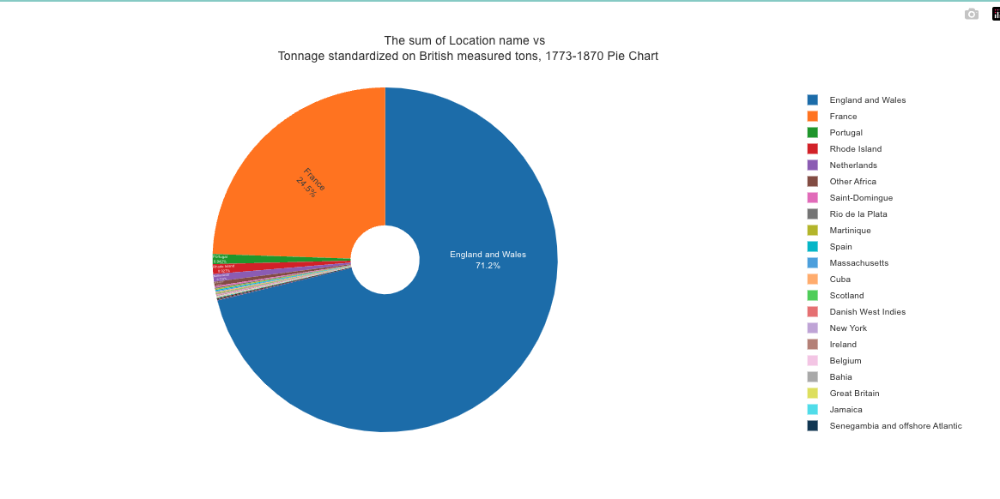

# PieGraph Component
The `PieGraph` component is a React component that displays a pie graph using Plotly.js library. It allows users to select options for the X and Y variables, choose an aggregation function, and visualize the data in a pie chart.

## Usage

```jsx
import PieGraph from "./PieGraph";

function ScrollPage() {
  return (
    <div>
      <PieGraph />
    </div>
  );
}

export default App;
```
## Dependencies
The `PieGraph` component has the following dependencies:

- `react`: A JavaScript library for building user interfaces.
- `react-plotly.js`: A React wrapper for Plotly.js, a charting library.
- `@mui/material`: Material-UI library for UI components.
- `@react-hook/window-size`: A hook that provides the current window size.
- `redux`: A predictable state container for JavaScript apps.
- `react-redux`: Official React bindings for Redux.
- `@reduxjs/toolkit`: A set of utility functions for working with Redux.
- `@reduxjs/toolkit/query`: A data-fetching library for Redux Toolkit.

Make sure to install these dependencies before using the `PieGraph` component.

## Props
The `PieGraph` component does not accept any props.

## Example
Here is an example of how to use the `PieGraph` component:

```jsx
import { useState } from "react";
import PieGraph from "./PieGraph";

function ScrollPage() {
  const [showPieGraph, setShowPieGraph] = useState(true);

  return (
    <div>
      <h1>My App</h1>
      <button onClick={() => setShowPieGraph(!showPieGraph)}>
        Toggle Pie Graph
      </button>
      {showPieGraph && <PieGraph />}
    </div>
  );
}

export default App;
```


In this example, a button is used to toggle the visibility of the `PieGraph` component. 
When the button is clicked, the pie graph will be shown or hidden accordingly.

