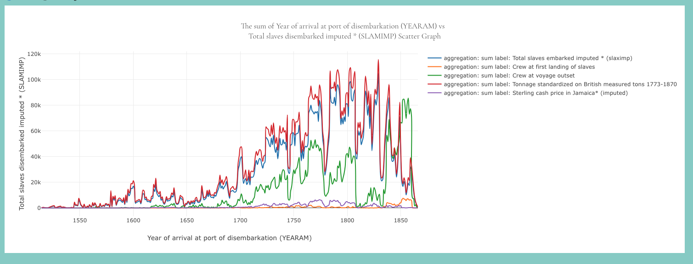

# Scatter

The Scatter component is a React component that displays a scatter graph using the Plotly.js library. It fetches data from an API and allows users to customize the graph by selecting different options.

## Features
- Fetches data from an API to populate the scatter graph.
- Allows users to select the X and Y variables for the scatter graph.
- Supports aggregation options (sum, average) for the Y variables.
- Displays a dropdown menu for selecting options.
- Supports multi-selection of Y variables using chips.
- Provides a responsive layout that adapts to different screen sizes.
## Dependencies

The Scatter component depends on the following libraries and modules:

- React: A JavaScript library for building user interfaces.
- Plotly.js: A JavaScript graphing library based on D3.js.
- MUI: Material-UI, a popular React UI framework.
- React Redux: A state management library for React.
- react-hook/window-size: A React hook for getting the window size.
## Usage
To use the Scatter component in your project, follow these steps:

- Install the required dependencies mentioned above.
- Import the Scatter component into your code.
- Place the Scatter component in your React component tree.
- Customize the component by passing the required props and options.

Import the necessary modules:


```jsx
import { useEffect, useState, FunctionComponent, ChangeEvent } from "react";
import { useSelector, useDispatch } from "react-redux";
import {
  setRangeValue,
  setKeyValue,
  setIsChange,
  setRangeSliderValue,
} from "@/redux/rangeSliderSlice";
import { Grid } from "@mui/material";
import { CustomSlider, Input } from "@/styleMUI";
import { AppDispatch, RootState } from "@/redux/store";
import {
  AutoCompleteInitialState,
  RangeSliderState,
} from "@/share/InterfaceTypes";
import { fetchRangeSliderData } from "@/fetchAPI/fetchRangeSliderData";
```

```jsx

import Scatter from "./Scatter";

function App() {
  return (
    <div>
      <Scatter />
    </div>
  );
}

export default App;
```

## `Props`

The Scatter component does not accept any props. However, it relies on the Redux store for managing state and fetching data from the API.

## Component Logic
The `Scatter Graph` component uses the `useState`, `useEffect`, `useCallback`, and `useSelector` hooks from React to manage state and handle side effects. It fetches data from an API using the `useGetOptionsQuery` and `fetchVoyageGraphGroupby` functions.

The component renders a `SelectDropdown` component for selecting options and variables, and an `AggregationSumAverage` component for selecting the aggregation type. The selected options and variables are used to generate the bar graph using the Plotly.js library.

The component also handles resizing of the graph based on the window size using the `useWindowSize` hook.

Ensure that the Redux store is properly set up in your application and that the required slices and actions are defined.

## Styling
The Scatter component uses SCSS stylesheets for styling. You can customize the styles by modifying the SCSS file associated with the Scatter component.

## Contributing
Contributions to the Scatter component are welcome. If you find a bug or want to add a new feature, please submit an issue or create a pull request on the GitHub repository.

