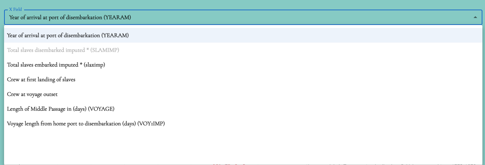
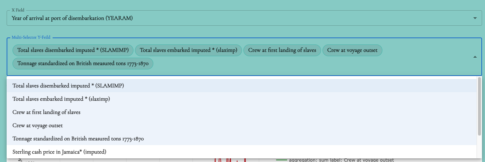

# SelectDropdown Component
This component is a custom dropdown menu used for selecting options and variables in a scatter plot graph or bar graph. It is implemented using the Material-UI library.

## Installation
No additional installation is required for this component.

## Usage
Import the necessary modules:
```jsx 

export const SelectDropdown: FunctionComponent<SelectDropdownScatterProps> = ({
  selectedX,
  selectedY,
  chips,
  selectedOptions,
  handleChange,
  handleChangeChipYSelected,
  maxWidth,
  XFieldText,
  YFieldText,
  optionsFlatY,
}) => {
    return (
    <div>
      <Box sx={{ maxWidth, my: 4 }}>
        <FormControl fullWidth>
          <InputLabel
            id="x-field-label"
            style={{ fontSize: 16, fontWeight: 600 }}
          >
            {XFieldText}
          </InputLabel>
          <Select
            value={selectedOptions.x_vars}
            label="X Field"
            style={{ fontSize: 16, fontWeight: 600 }}
            onChange={(event: SelectChangeEvent<string>) => {
              handleChange(event, "x_vars");
            }}
          >
            {selectedX.map((option: PlotXYVar, index: number) => (
              <MenuItem
                key={`${option.label}-${index}`}
                value={option.var_name}
                disabled={isDisabledX(option)}
              >
                {option.label}
              </MenuItem>
            ))}
          </Select>
        </FormControl>
      </Box>
    </div>
  );
}
```
## Component Structure
The component structure includes MUI components such as `FormControl`, `MenuItem`, `InputLabel`, and `Box` to handle the selection drowpdown and display if needed.

## Example Usage
```jsx
import { SelectDropdown } from "./SelectDropdown";

function Scatter() {
  return (
    <div>
      <SelectDropdown
        selectedX={selectedX}
        selectedY={selectedY}
        chips={chips}
        selectedOptions={scatterOptions}
        handleChange={handleChangeVoyageOption}
        handleChangeChipYSelected={handleChangeScatterChipYSelected}
        maxWidth={maxWidth}
        XFieldText="X Field"
        YFieldText="Multi-Selector Y-Feild"
        optionsFlatY={VOYAGE_SCATTER_OPTIONS.y_vars}
      />
    </div>
  );
}
```

## Props
The SelectDropdown component accepts the following props:

- `selectedX` (array of PlotXYVar): The selected X-axis variables.
- `selectedY` (array of PlotXYVar): The selected Y-axis variables.
- `chips` (array of strings): The selected Y-axis variables as chips.
- `selectedOptions` (object): The currently selected options.
- `handleChange` (function): Callback function for handling changes in the dropdown selection.
- `handleChangeChipYSelected` (function): Callback function for handling changes in the selected Y-axis variables.
- `maxWidth` (number, optional): The maximum width of the component.
- `XFieldText` (string, optional): The label for the X-axis field.
- `YFieldText` (string, optional): The label for the Y-axis field.
- `optionsFlatY` (array of PlotXYVar): The available Y-axis variables.






<br/>
That's it! You can now use the `SelectDropdown` component to provide min and max values in your application.