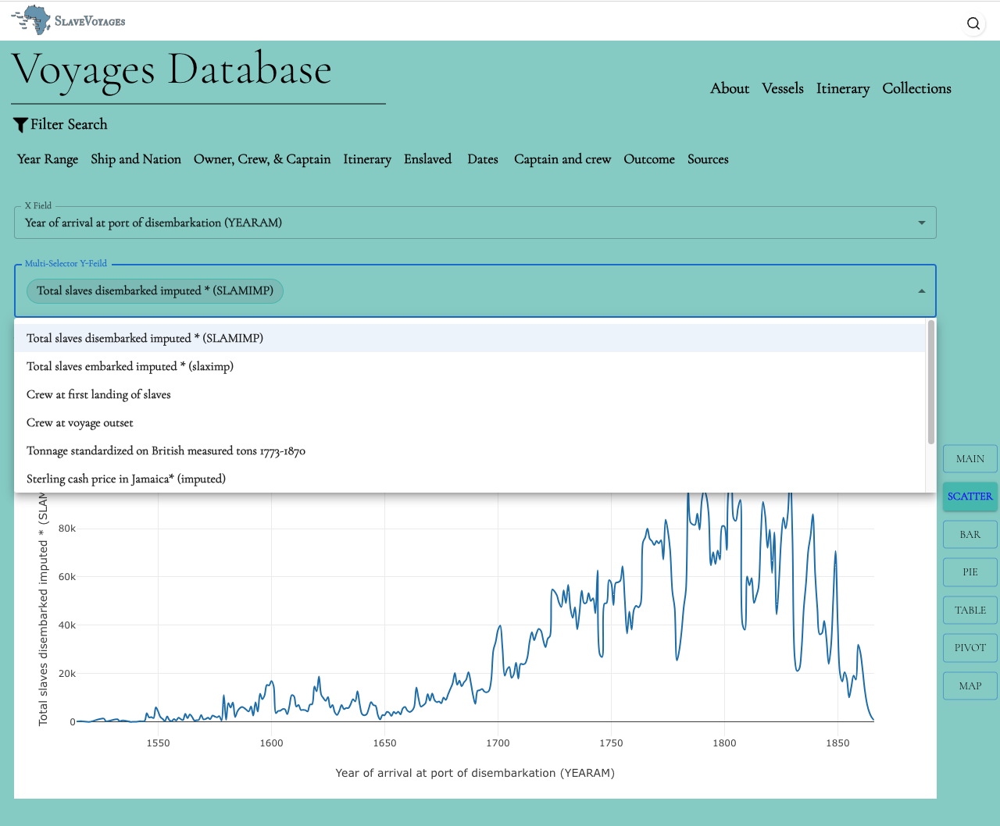

# Voyage Page

This Readme file provides an explanation of the Voyage Page folder and how to use it in the application.

## Introduction
The Voyage Page folder contains voyage components related to the components for represents voyages application as as `ScrollPage`, `RangeSlider`, `AutocompletedBox`, `Scatter Graph` , `Bar Garaph` or `SelectDropdown` and more....


## Folder Structure
```
voyagePage/
|- index.md
|- ScrollPage.md
|- VoyagePage.md
|- Results/
        |- AggregationSumAverage.md 
        |- AutocompletedBox.md
        |- BarGraph.md 
        |- PieGraph.tsx
        |- RangeSlider.md 
        |- Scatter.md 
        |- SelectDropdown.md 
        |- SelectDropdownSingle.md 
        |- Table.md 
```

Example: 



That's it! You can now use the yoyage Page to display the other components in your application.