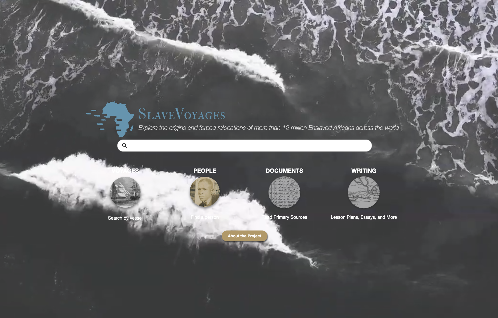

# Welcome to Slavevoyages
Explore the origins and forced relocations of more than 12 million Enslaved Africans across the world

Django application for the Trans-Atlantic Slave Trade Database which has information on more than 35,000 slave voyages that forcibly embarked over 12 million Africans for transport to the Americas between the sixteenth and nineteenth centuries.

