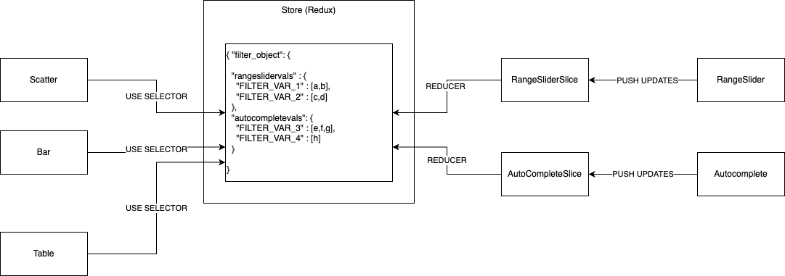

# Redux Store
The Redux store in the Voyages application serves as a centralized data store that holds the application state. It follows the principles of the Redux architecture and facilitates predictable state management.


## Store Structure
The store is structured as follows:

```
store/
|- actions && reducer/
        |- getAutoCompleteSlice.md 
        |- getOptionsDataSlice.md
        |- getOptionsFlatObjSlice.md 
        |- getScrollPageSlice.md 
        |- rangeSliderSlice.md 
|- store.js

```

### `Actions`: 
This directory contains action-related files, which defines the action types used in the application and contains action creators for managing voyage-related data.

### `Reducers`: 
This directory contains reducer functions responsible for handling specific parts of the application state. For example, getAutoCompleteSlice.js manages the voyage-related data in the store.

### `store.ts`: 
This file creates the Redux store by combining the reducers, applying middleware, and providing initial state or enhancers if necessary.

## `State Managemen`t
The Redux store in the Voyages application manages the following parts of the application state:




## Usage

```jsx
import { configureStore } from "@reduxjs/toolkit";
import getOptionsDataSlice from './getOptionsDataSlice';
import rangeSliderSlice from './rangeSliderSlice';
import getAutoCompleteList from './getAutoCompleteSlice'
import getOptionsFlatMenu from './getOptionsFlatObjSlice'
import getScrollPageSlice from "./getScrollPageSlice"
import { voyagesApi } from '../fetchAPI/fetchApiService';
import { setupListeners } from "@reduxjs/toolkit/dist/query";


const store = configureStore({
    reducer: {
        getOptions: getOptionsDataSlice,
        rangeSlider: rangeSliderSlice,
        autoCompleteList: getAutoCompleteList,
        optionFlatMenu: getOptionsFlatMenu,
        getScrollPage: getScrollPageSlice,
        [voyagesApi.reducerPath]: voyagesApi.reducer
    },
    middleware: (getDefaultMiddleware) =>
        getDefaultMiddleware({
            serializableCheck: false,
        }).concat(voyagesApi.middleware)
});

setupListeners(store.dispatch);

export type AppDispatch = typeof store.dispatch;
export type RootState = ReturnType<typeof store.getState>;

export default store;

```

## Store Configuration
The Redux store in the Voyages application is configured by combining the reducers using the combineReducers function from Redux. Middleware can be applied using Redux middleware libraries, and the initial state or enhancers can be provided as needed.

Please refer to the individual slice files in the actions && reducer directory for more specific information on each slice of the application state.