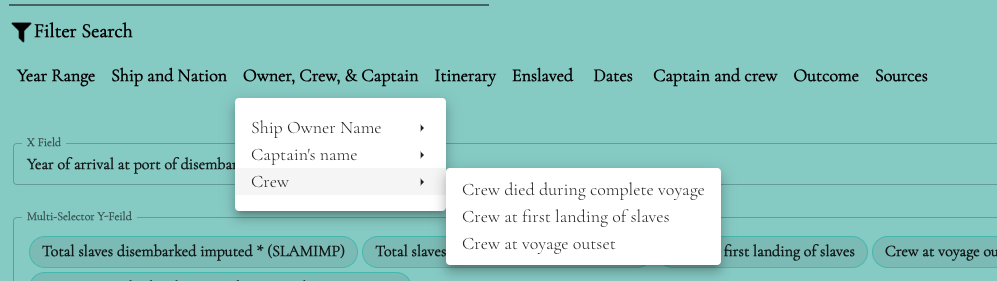
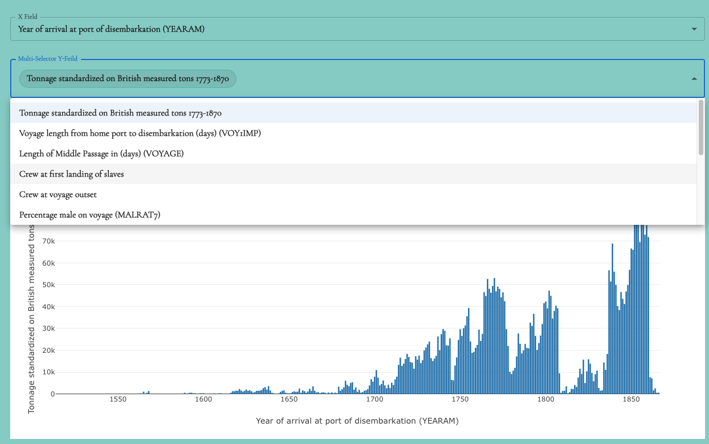

# Utils Folder
The "utils" folder in this application contains utility functions and helper modules that provide various commonly used functionalities across different parts of the application. These utilities serve to improve code organization, reusability, and maintainability.

```
│── utils
│     ├── flatfiles --> all json files
│     │     ├── african_origins_filter_menu.json
│     │     ├── african_origins_table_cell_structure.json
│     │     ├── enslaved_filter_menu.json
│     │     ├── enslaved_options.json
│     │     ├── enslaved_table_cell_structure.json
│     │     ├── enslaver_options.json
│     │     ├── people_page_data.json
│     │     ├── texas_filter_menu.json
│     │     ├── texas_table_cell_structure.json
│     │     ├── transatlantic_voyages_filter_menu_SIMPLE.json
│     │     ├── transatlantic_voyages_filter_menu.json
│     │     ├── varnamechecker.py
│     │     ├── VOYAGE_BARGRAPH_OPTIONS.json
│     │     ├── VOYAGE_COLLECTIONS.json
│     │     ├── VOYAGE_PIECHART_OPTIONS.json
│     │     ├── VOYAGE_SCATTER_OPTIONS.json
│     │     ├── voyage_table_cell_structure__updated21June.json
│     ├── functions
│     │     ├── generateRowsData.ts
│     │     ├── getRowsPerPage.ts
│     │     ├── getColorStyle.ts
│     │     ├── hasValueGetter.ts
│     │     ├── TableCollectionsOptions.ts
│     │     ├── traverseData.ts
```

The folder contains multiple utility files, each focusing on a specific area or functionality. This modular approach allows for easier maintenance and separation of concerns.

- ```getEnumColumnParams.ts```
This file includes utility functions related to the table column with cellRenderer 

- ```transatlantic_voyages_filter_menu.json && transatlantic_voyages_filter_menuTEST.json```

This file file provides utility datas as json for working with voyages filter and displays on the menu bar, will call from the function 
<code>getOptionsFlatObjSlice</code>
in the reduce reducer.

## Usage
```js
import { createSlice } from "@reduxjs/toolkit"
import jsonData from '@/utils/transatlantic_voyages_filter_menu.json'
import jsonData from '@/utils/transatlantic_voyages_filter_menuTEST.json'
const initialState = {
    value: jsonData
};
export const getOptionsFlatObjSlice = createSlice({
    name: "menuOptionFlat",
    initialState,
    reducers: {
        getOptionsFlatMenu: (state, action) => {
            state.value = action.payload;
        }
    }
})

export const { getOptionsFlatMenu } = getOptionsFlatObjSlice.actions;
export default getOptionsFlatObjSlice.reducer;

```
## Display at the menu bar



- ```VOYAGE_BARGRAPH_OPTIONS.json && VOYAGE_SCATTER_OPTIONS.json```
This file file provides utility datas as json to display with BarGraph and Scatter as the dropdown selection menu
<code>getOptionsFlatObjSlice</code>
in the <code>BarGraph.tsx</code> and  <code>Scatter.tsx</code>


- <code>Scatter.tsx</code>


- <code>BarGraph.tsx</code> 



<br>
<h3> Contribution </h3>
If you would like to contribute to the "utils" folder by adding more utility functions or improving existing ones, please follow the contribution guidelines outlined in the project's main README file.